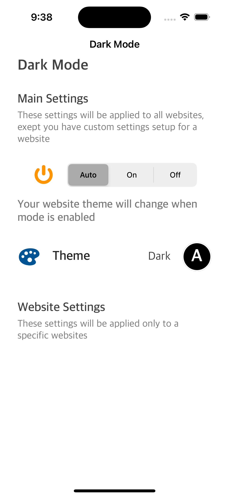
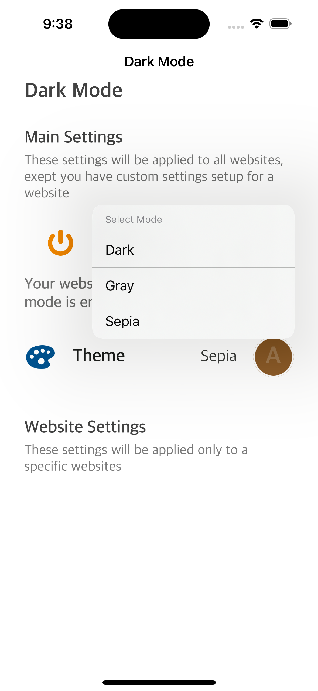
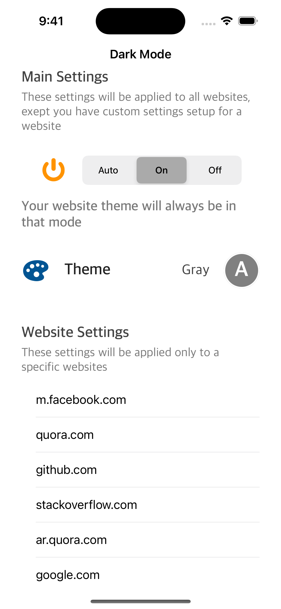
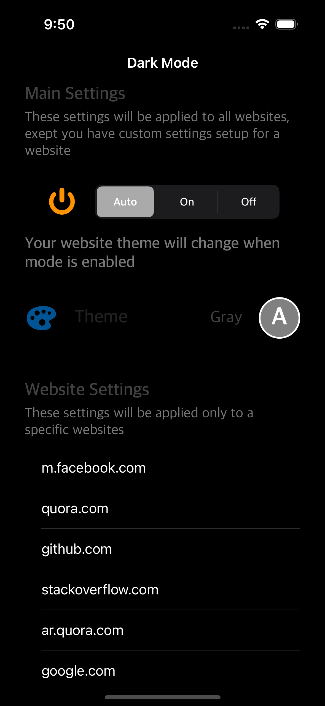

# Safari-Darkula
This is an iOS extension for Safari (iOS) which allow you change the theme of any website (Dark, Gray, and Sepia Modes)

First app launch                                       | Changing the theme                                     | Use the extension!
:-----------------------------------------------------:|:------------------------------------------------------:|:----------------------------------------------------------------:
 |  | 
Displaying the websites that uses the extesnion                   | App appearnce comfortable with system appearance
 | 
