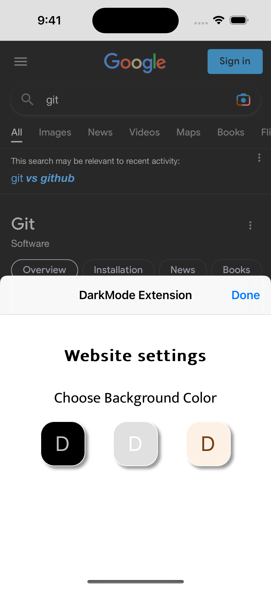

# Safari-Darkula
This is an iOS app that has an extension for Safari (iOS) to allow you to change the theme of any website (Dark, Gray, and Sepia Modes)

First app launch                                       | Changing the theme                                     | Use the extension!
:-----------------------------------------------------:|:------------------------------------------------------:|:----------------------------------------------------------------:
 |  | 
Displaying the websites that uses the extension                   | App appearance is comfortable with the system appearance
 | 

## Features
- [x] Usage Of HTML
- [x] Usage of CSS
- [x] Usage of JavaScript
- [x] Communication between separate targets

## Requirements
- Swift 5+
- Xcode 12+

## Installation
**To install this app:-**
1. Ensure you have Xcode installed for the iOS app setup.
2. Once the app is built, install it on your device.
3. Choose your preferred theme: `ON`, `OFF`, or `Auto` (adjusts based on time).
4. So you can Select `ON` for continuous activation.
5. Access detailed descriptions for themes within the app.
6. Open Safari and locate **`AA`** behind the URL field.
7. Manage extensions to enable the dark mode extension.
8. Choose your preferred mode from the extension's popup and set it for specific or all websites.

### Enjoy using the app!!
